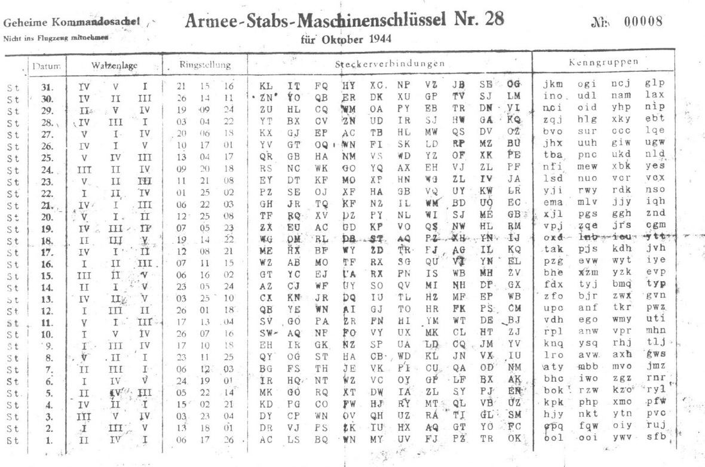

# The Enigma Cipher

### _The Enigma Cipher project recreates the historic Enigma I machine, the most popular version used during World War II, using Python to encode and decode messages. It employs the principles of the Enigma encryption system, incorporating rotors, reflectors, and the plugboard._  
### _The inspiration for this project came to me after watching the movie [The Imitation Game (2014)](https://www.youtube.com/watch?v=nuPZUUED5uk), which shows Alan Truing with his team trying to break the Enigma cipher at Bletchley Park._  

### A changelog for the project can be found [here](https://github.com/DanielDekhtyar/The-Enigma-Cipher/blob/main/CHANGELOG.md).  

   

  

  

  

# How to use the machine? I'm glad you asked!

## Installation :  
- To use the app you can download the `The Enigma Cipher.exe` file and run it.
- To download the exe file click [here](https://github.com/DanielDekhtyar/The-Enigma-Cipher/raw/main/The%20Enigma%20Cipher.exe).

### After opening the app you should see something similar to this:

## Configuring the Enigma machine : 
 Here is an example of the `daily settings sheet`. It shows the configuration for the enigma for all the days of the month.  
 Every month a new settings sheet was given to all the Enigma operators in the German Military so no configuration was ever used twice.  
 The settings sheet is how the operators knew how to set up their Enigmas so all the Enigma machines were with the same settings on any given day.  
 You can find more of those [here](https://www.google.com/search?q=enigma+settings+code+sheet&newwindow=1&sca_esv=eecfb1e247dfd8d4&udm=2&biw=1536&bih=722&sxsrf=ACQVn0_StacF1nd-XovoF-shNo1GkccIqQ%3A1708018546816&ei=ckvOZbueMcuH9u8P46mloAo&ved=0ahUKEwi7n4L28K2EAxXLg_0HHeNUCaQQ4dUDCBA&uact=5&oq=enigma+settings+code+sheet&gs_lp=Egxnd3Mtd2l6LXNlcnAiGmVuaWdtYSBzZXR0aW5ncyBjb2RlIHNoZWV0SOQMULsCWO0IcAF4AJABAJgB5QGgAcgHqgEFMC40LjG4AQPIAQD4AQHCAgQQIxgn4gMEGAEgQYgGAQ&sclient=gws-wiz-serp).

  

We will focus on just one day. Let's say the `14th of October 1944 (14. Oktober 1944)`. You can find the settings for that day by the number 14 in the `Date (Datum)` column on the left side of the sheet.

- ### Set up the rotors
    - The Enigma machine comes with a set of 5 rotors with roman letters on them. `I II III IV V`.  
    We can find today's rotor selection in the `Rotors position (Walzenlage)` column.  
    Per the daily setting, the rotors that we will use today are `II I V`.  
      
    We can set it in the `Number` left-most column in the app like this:  
      
  
    - Next, we should set the ring shift from the `Ring positioning (Ringstlung)` column.  
    This setting shifts the letters by a predetermined number of letters. In other words, it's a Caesar cipher.  
    Per the daily settings, the rotor shift is `23 05 24`.  
      
    We can set it in the `Shift` right-most column in the app like this:  
      
  
    - The `initial position of the rotors (Grundstellung)` was decided by the transmitting operator and was different for every single message. No special rules here.  
    Let's say that we decide on the starting position `17 23 08`.  
    If so, we can set it in the `Position` center column in the app like this:  
     

    Please notice that this app uses the UKW-B reflector.
    This setting is predetermined and you cannot change it.

- ### Set up the plugboard
In the middle of the settings sheet, you can find `Plugboard (Steckerverbindungen)` settings.  
Those are letter pairs. Each of the letters will be substituted for its pair and vice versa.
In the German Enigma, only 10 letter pairs were usually used but in the app, you can use as many as 13 pairs.
The plugboard settings for today are as follows:  
  
In the app, the plugboard setup will look something like this:  
  
You may notice that some of the plugs are empty. A letter that has no letter pair, would not change.  
The order of the letters has no difference as long as every letter is by its respective pair letter.  

- ### Encryption
Now after we set up our machine for today's settings we can finally get to the fun part. Encrypting the messages.  
Just input your message in the `Input Text` field and click `Encipher Text`!  

_That's it!_  
 
Like magic, the message is now encrypted and you can send secret messages to your friend.  
Just make sure that they have all the settings set the same way you do, otherwise, it won't work.  

- ### Decryption
To decrypt a message you have to make sure that both the sender and the receiver have the same settings.  
Then just put the encrypted message into the `Input Text` field and click `Encipher Text`.  
You should see the decrypted message right away!  
  
Please notice that only English characters will be encrypted. Any punctuation marks, numbers and whitespace will be left as it is.  

### _Enjoy!_

  
# Credits
I want to mention and say thanks to all the resources on the internet that helped me understand how the Enigma machine works.  
A great video I would recommend is by Jared Owen - How did the Enigma Machine work?:  

Here is another video by Numberphile - 158,962,555,217,826,360,000 (Enigma Machine):

And another video about how Alan Turing's Bombe Machine broke the Enigma :

How Enigma was cracked by Ingenious

Another great resource is the Crypto Museum. Click [here](https://www.cryptomuseum.com/crypto/enigma/i/).

## Thank you for using my Enigma machine!
